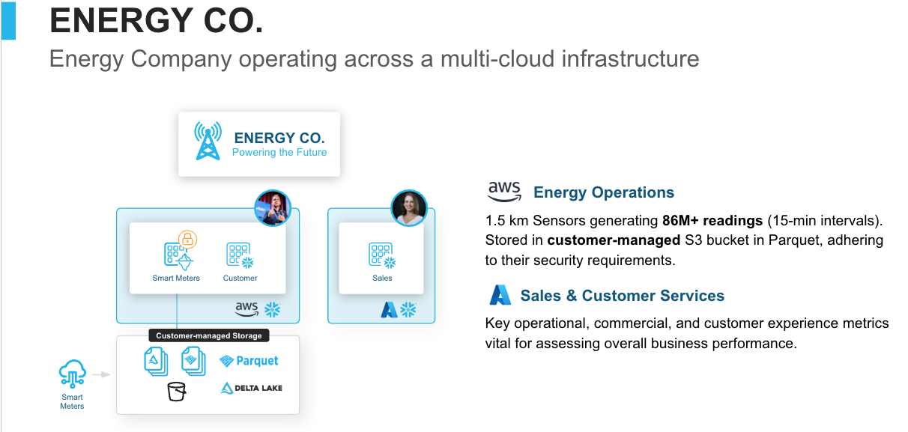

# Snowflake Demo: Energy Consumer Analytics

## Overview

This demo showcases Snowflake's capabilities for an energy consumer company, demonstrating how to integrate and analyze data from multiple sources to drive business insights. The demo combines **smart meter IoT data** from AWS with **sales and CRM data** to enable cross-functional analytics.

## Business Scenario

Your energy company operates across a multi-cloud infrastructure:

### AWS Account - Energy Operations
- **Smart Meters**: 1,500 meters generating 86M+ readings (15-minute intervals)
- **Data Storage**: Iceberg tables in your S3 bucket (zero Snowflake storage costs)
- **Customer Data**: 1,500 customers with sensitive PII (SSN, credit cards, addresses)
- **Security Applied**: Data masking policies on customer IDs, consumption metrics, and costs
- **Data Product**: Complete analytics package including:
  - Secure, governed energy consumption data
  - Semantic view for business-friendly queries
  - Interactive Snowflake Notebook for analysis and visualization

### Data Sharing via Internal Marketplace
- **Source**: AWS Snowflake account (ENERGY database)
- **Destination**: Azure Snowflake account (SALES database)
- **Method**: Cross-cloud data sharing through Snowflake's internal marketplace
- **Governance**: Security policies travel with the data - masking enforced in consuming account
- **Auto-Fulfillment**: Snowflake automatically replicates data to Azure region, minimizing egress costs and latency
- **Zero ETL**: No manual data pipelines or transformation logic required

### Azure Account - Sales & Customer Service
- **Sales Data**: 2,521 transactions, 13 products, 75 sales representatives
- **Customer Interactions**: 3,018 service interactions with satisfaction scores
- **Shared Data**: Live access to masked energy consumption data from AWS
- **Analytics**: Cortex Analyst agent (SALES_360) joins energy operations data with sales/CRM data

### Business Goals
1. **Revenue Growth**: Identify high-usage customers for product upsell ($500K+ opportunity)
2. **Customer Retention**: Detect churn risk by correlating energy costs with satisfaction scores
3. **Sales Optimization**: Target the right customers with personalized product recommendations
4. **Cross-Cloud Collaboration**: Enable sales teams (Azure) to leverage operational data (AWS) without data silos
5. **Unified Analytics**: Natural language queries across energy and sales data via Cortex Analyst

### Key Differentiators
- **Automated Replication**: Snowflake's auto-fulfillment handles cross-cloud data replication, minimizing egress costs
- **Unified Governance**: Security policies enforced across clouds and regions
- **Self-Service Analytics**: Business users ask questions in natural language via Cortex Analyst
- **Cost Optimization**: Iceberg tables = $0 Snowflake storage, pay only for compute

## Key Demo Points

### 1. **Data Products = Packaged Analytics for the Enterprise**
- **Complete Package**: Secure data + semantic views + interactive notebooks
- **Internal Marketplace**: Share data products across organization accounts
- **Catalog Discovery**: Easily find and request data products through Snowflake's unified catalog
- **Governed Sharing**: Security policies travel with the data product to consuming accounts
- **Auto-Fulfillment**: Snowflake handles cross-cloud replication automatically

### 2. **Modern Architecture = Zero Storage Costs**
- **Iceberg tables** with data in YOUR S3 bucket
- **86M records** loaded in seconds (not hours)
- **$0 Snowflake storage** - pay only for compute
- **2-4x faster** queries with vectorized scanner

### 3. **Security on External Data**
- Apply **masking policies** to S3-resident data
- **Role-based access** control
- Security enforced even on externally-stored data
- Full governance + cost savings

### 4. **Cross-Cloud Analytics with Cortex Analyst**
- **Natural Language Queries**: Ask questions in plain English
- **SALES_360 Agent**: Pre-built semantic model joining energy + sales data
- **Cross-Cloud Insights**: Query AWS data from Azure seamlessly
- Find **$600K+ sales opportunities** with AI-powered analytics

## Dataset Details

### Smart Meter Data (`data/smart_meter/`)

#### 1. Customer PII (`customers_pii.parquet`)
- **1,500 customers** with realistic sensitive data
- **Sensitive Fields**: SSN, Credit Card Numbers, DOB, Contact Info
- Fields: customer_id, first_name, last_name, email, phone, ssn, date_of_birth, street_address, city, state, zip_code, credit_card_number, customer_type, service_plan, billing_cycle, enrollment_date

#### 2. Meter Readings (partitioned by `year=YYYY/month=MM/`)
- **86.2 million readings** (15-minute intervals throughout 2024 and 2025)
- **Date Range**: January 2024 - December 2025 (2 full years)
- **Total Consumption**: 195.2M kWh
- **Total Cost**: $38.5M
- **File Structure**: Partitioned by year/month (24 partition folders, 17-30 MB each)
- Fields: meter_id, customer_id, timestamp, consumption_kwh, voltage, power_factor, rate_per_kwh, cost_usd, reading_status, temperature_celsius
- Includes realistic patterns:
  - Peak usage during business hours (commercial)
  - Morning/evening peaks (residential)
  - Seasonal variations (AC in summer, heating in winter)
  - Time-of-use pricing (peak/mid-peak/off-peak rates)

### Sales Data (`data/sales/`)

#### 1. Sales Representatives (`sales_representatives.parquet`)
- **75 sales reps** across 5 territories (scaled for larger customer base)
- Fields: rep_id, rep_name, email, phone, territory, hire_date, commission_rate

#### 2. Products (`products.parquet`)
- 13 products across 4 categories:
  - Service Plans (Basic, Standard, Premium)
  - Smart Devices (Thermostats, Monitors, Solar kits)
  - Services (Audits, Installation, Warranty)
  - Renewable Energy (Solar panels, Battery storage, Green credits)
- Fields: product_id, product_name, category, base_price, description

#### 3. Transactions (`transactions.parquet`)
- **2,521 sales transactions**
- **Total Revenue**: $627,750
- **Top Category**: Renewable Energy ($384K - solar panels and battery storage)
- **Date Range**: 2024-2025
- Fields: transaction_id, customer_id, rep_id, product_id, transaction_date, quantity, unit_price, discount_percent, total_amount, payment_method, transaction_status, channel

#### 4. Customer Interactions (`customer_interactions.parquet`)
- **3,018 customer service interactions**
- **Avg Satisfaction**: 4.15/5.0
- **Average per Customer**: 2.0 interactions
- Fields: interaction_id, customer_id, rep_id, interaction_date, interaction_type, reason, duration_minutes, resolution, satisfaction_score, notes

## Cortex Analyst - Natural Language Analytics

The **SALES_360** Cortex Analyst agent enables business users to ask questions in natural language across the unified energy and sales data. Here are the top 5 business questions:

### 1. High-Risk Customer Analysis
**Question:** *"Which customer segments have the highest energy costs but lowest satisfaction scores?"*

**Business Value:** Identifies potential churn risks among high-value customers, enabling proactive retention strategies before customers leave.

---

### 2. Product-Energy Alignment
**Question:** *"Which products generate the most revenue from high-consumption Industrial customers?"*

**Business Value:** Optimize product mix and sales targeting for different energy consumption profiles to maximize revenue per customer.

---

### 3. Service Plan Upsell Opportunities
**Question:** *"Which Basic plan customers have consumption patterns similar to Premium plan customers?"*

**Business Value:** Target customers for service plan upgrades, increasing monthly recurring revenue with data-driven recommendations.

---

### 4. Territory Performance
**Question:** *"Show sales revenue by territory and average customer energy consumption"*

**Business Value:** Identify high-potential territories based on energy usage patterns to optimize territory assignments and resource allocation.

---

### 5. Customer Lifetime Value
**Question:** *"What's the total revenue per customer segment, including energy costs and product purchases?"*

**Business Value:** Calculate true customer lifetime value across both energy operations and product sales to identify VIP customers and inform strategic decisions.
